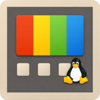

<p align="center">
  
</p>

<h1 align="center">MyPowerToys</h1>

<p align="center">
  <strong>A suite of system utilities for Linux, inspired by Microsoft PowerToys.</strong><br>
  Written entirely in Rust. Modular, lightweight, Wayland + X11 compatible.
</p>

<p align="center">
  <a href="https://github.com/pedrokarim/my-power-toys/actions"></a>
  
  
  
</p>

---

## What is this?

MyPowerToys brings the best ideas from [Microsoft PowerToys](https://github.com/microsoft/PowerToys) to Linux, reimplemented from scratch in Rust. It runs as a lightweight background daemon with a tray icon, and each tool is an independent module you can enable or disable.

## Modules

| Module | Description | Hotkey |
|--------|------------|--------|
| **Always on Top** | Pin any window above all others | `Super+T` |
| **Awake** | Prevent screen sleep / suspend | Tray toggle |
| **Paste as Plain Text** | Paste without formatting | `Super+Ctrl+V` |
| **Color Picker** | Pick any color from screen (HEX, RGB, HSL) | `Super+Shift+C` |
| **Hosts Editor** | GUI editor for `/etc/hosts` with toggle on/off | - |
| **Bulk Rename** | Batch rename files with regex and preview | - |
| **Image Resizer** | Batch resize images (presets + custom) | - |
| **Key Manager** | Remap keys, create shortcuts, per-app rules | - |
| **Mouse Utilities** | Find My Mouse, click highlighter, crosshair | `Ctrl+Ctrl` |
| **Screen Ruler** | Measure pixels on screen | `Super+Shift+R` |
| **Text Extractor** | OCR: extract text from any screen region | `Super+Shift+T` |
| **Shortcut Guide** | Overlay showing available keyboard shortcuts | Hold `Super` |
| **App Launcher** | Quick app launcher with search + calculator | `Alt+Space` |
| **FancyZones** | Advanced window tiling with custom zone layouts | `Super+Shift+Z` |
| **Peek** | Quick file preview (images, text, PDF, media) | `Ctrl+Space` |

## Architecture

```
my-power-toys/
├── crates/
│   ├── common/          # Shared: PowerModule trait, config, hotkeys, IPC
│   ├── daemon/          # Central daemon: tray icon, D-Bus, module registry
│   ├── ui/              # Settings GUI (iced)
│   ├── cli/             # CLI control tool (mpt-ctl)
│   └── <modules>/       # 15 independent module crates
├── assets/              # Logo, icons, .desktop files, systemd service
└── packaging/           # Build scripts for deb, rpm, AUR
```

- **Modular**: each tool is its own Rust crate, can be enabled/disabled independently
- **Lightweight**: daemon sits quietly in the tray, modules load on demand
- **Native**: Wayland + X11 support with automatic detection
- **IPC**: D-Bus interface (`org.mypowertoys.Daemon`) for external control
- **Configurable**: per-module TOML configs in `~/.config/my-power-toys/`

## Tech Stack

| Component | Technology |
|-----------|-----------|
| Language | Rust (edition 2024) |
| UI (Settings) | [iced](https://iced.rs) |
| UI (Overlays) | [egui](https://github.com/emilk/egui) |
| Tray Icon | [ksni](https://crates.io/crates/ksni) (StatusNotifierItem) |
| IPC | [zbus](https://crates.io/crates/zbus) (D-Bus) |
| Window Mgmt | `x11rb` / wlr-protocols |
| Config | `serde` + `toml` |
| Async | `tokio` |

## Installation

### From source (recommended)

```bash
# Prerequisites
sudo apt install libdbus-1-dev libwayland-dev  # Debian/Ubuntu
# or
sudo pacman -S dbus wayland                     # Arch

# Clone and install
git clone https://github.com/pedrokarim/my-power-toys.git
cd my-power-toys
./packaging/install.sh
```

This will:
- Build all binaries in release mode
- Install `mpt-daemon`, `mpt-settings`, `mpt-ctl` to `~/.cargo/bin/`
- Set up autostart and systemd user service

### Arch Linux (AUR)

```bash
# Using the PKGBUILD
cd packaging
makepkg -si
```

### Debian/Ubuntu (.deb)

```bash
./packaging/build-deb.sh
sudo dpkg -i target/deb/my-power-toys_0.1.0_amd64.deb
```

## Usage

### Start the daemon

```bash
# Directly
mpt-daemon

# Or via systemd
systemctl --user enable --now my-power-toys.service
```

### Open the settings UI

```bash
mpt-settings
```

### CLI control

```bash
mpt-ctl list                  # List all modules and their status
mpt-ctl start always-on-top   # Start a module
mpt-ctl stop awake            # Stop a module
mpt-ctl trigger color-picker  # Trigger a module's hotkey action
mpt-ctl ping                  # Check if daemon is running
```

### D-Bus interface

```bash
# List modules
busctl --user call org.mypowertoys.Daemon \
  /org/mypowertoys/Daemon org.mypowertoys.Daemon ListModules

# Start a module
busctl --user call org.mypowertoys.Daemon \
  /org/mypowertoys/Daemon org.mypowertoys.Daemon StartModule s "awake"

# Ping
busctl --user call org.mypowertoys.Daemon \
  /org/mypowertoys/Daemon org.mypowertoys.Daemon Ping
```

## Configuration

All config lives in `~/.config/my-power-toys/`:

```
~/.config/my-power-toys/
├── daemon.toml          # Global config (modules enabled, theme)
├── color-picker.toml    # Per-module config
├── key-manager.toml
├── fancy-zones.toml
└── ...
```

Example `daemon.toml`:

```toml
[general]
autostart = true
theme = "system"

[modules]
always-on-top = { enabled = true, hotkey = "Super+T" }
awake = { enabled = true }
color-picker = { enabled = true, hotkey = "Super+Shift+C" }
```

## Optional dependencies

Some modules require external tools:

| Dependency | Used by | Install |
|-----------|---------|---------|
| `tesseract` | Text Extractor (OCR) | `sudo apt install tesseract-ocr` |
| `wl-clipboard` | Paste Plain, Color Picker (Wayland) | `sudo apt install wl-clipboard` |
| `xclip` | Paste Plain, Color Picker (X11) | `sudo apt install xclip` |
| `xdotool` | Paste Plain, Key Manager (X11) | `sudo apt install xdotool` |
| `imagemagick` | Peek (image dimensions) | `sudo apt install imagemagick` |
| `ffmpeg` | Peek (media duration) | `sudo apt install ffmpeg` |
| `pdfinfo` | Peek (PDF preview) | `sudo apt install poppler-utils` |

## Development

```bash
# Build
cargo build

# Run tests (76 tests)
cargo test

# Lint
cargo clippy --all-targets -- -D warnings

# Format
cargo fmt --all

# Run the daemon in dev mode
RUST_LOG=debug cargo run --bin mpt-daemon
```

## Project structure

```
17 crates, 3 binaries, 76 tests

Binaries:
  mpt-daemon     Background daemon (tray + D-Bus + module management)
  mpt-settings   Settings GUI (iced)
  mpt-ctl        CLI control tool

Crates:
  common         Shared library (PowerModule trait, config, hotkeys, platform)
  daemon         Central daemon
  ui             Settings UI
  cli            CLI tool
  + 15 module crates (always-on-top, awake, paste-plain, ...)
```

## Contributing

1. Each module is an independent crate - easy to work on in isolation
2. Implement the `PowerModule` trait from `mpt-common`
3. Add tests and TOML config
4. Register in `daemon/src/modules.rs`

```rust
pub trait PowerModule: Send + Sync {
    fn id(&self) -> &'static str;
    fn name(&self) -> &'static str;
    fn description(&self) -> &'static str;
    fn default_hotkey(&self) -> Option<Hotkey> { None }
    fn start(&mut self) -> Result<()>;
    fn stop(&mut self) -> Result<()>;
    fn is_running(&self) -> bool;
    fn on_hotkey(&mut self) -> Result<()> { Ok(()) }
}
```

## License

[GPL-3.0](LICENSE)

## Author

**Ahmed Karim** ([@pedrokarim](https://github.com/pedrokarim))
